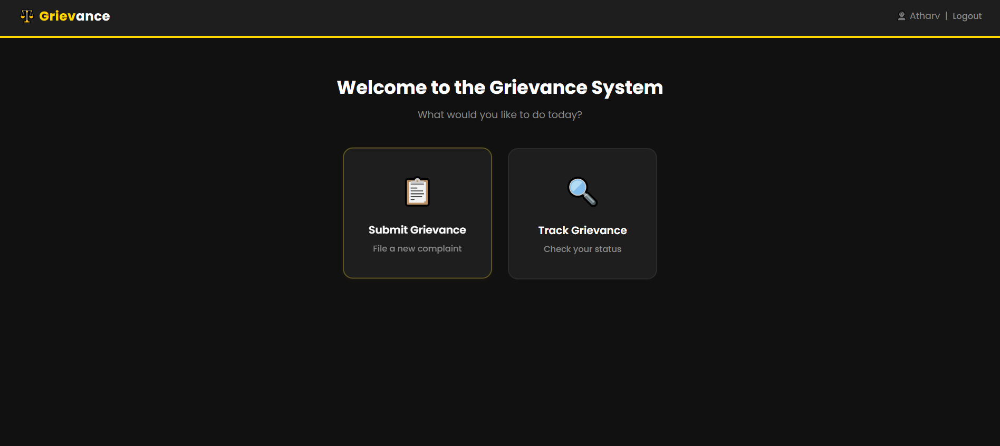
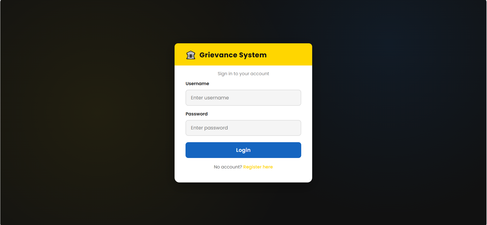
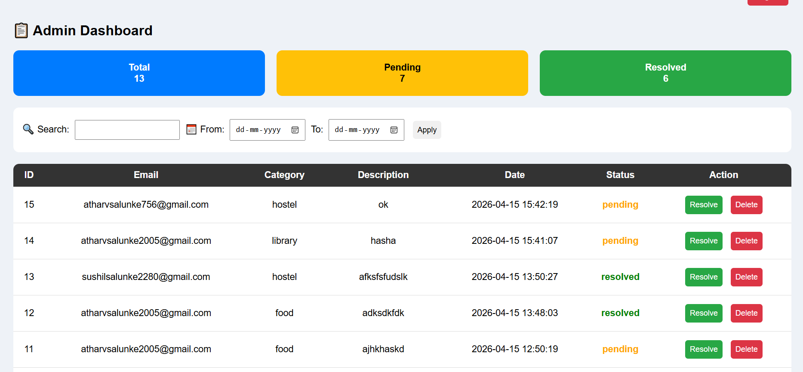
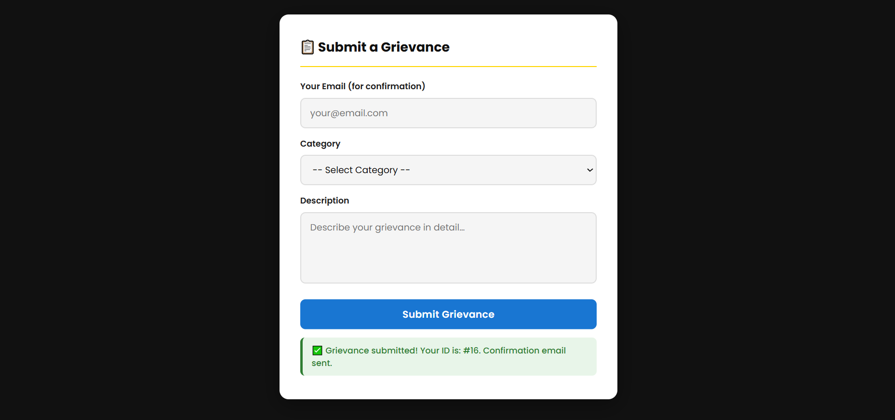

# Grievance Management System

## Project Overview
The Grievance Management System is a web-based application developed using PHP and MySQL. This project allows users to register, log in, submit grievances, and track their complaint status online. An admin can manage and update the grievances through the admin dashboard.

---

## Features

### User Features
- User Registration and Login
- Submit Grievances
- Track Complaint Status
- Email Notifications
- Responsive Interface

### Admin Features
- Admin Login
- View All Complaints
- Update Complaint Status
- Delete Complaints
- Dashboard Management

---

## Technologies Used

- PHP
- MySQL
- HTML
- CSS
- JavaScript
- PHPMailer

---

## Project Structure

```text
pj1_modified/
│
├── admin.php
├── dashboard.php
├── db.php
├── login.php
├── register.php
├── submit_grievance.php
├── process_grievance.php
├── update_status.php
├── delete.php
├── logout.php
├── style.css
├── styles.css
├── demo.sql
├── PHPMailer/
└── ...
```

---

## Installation Steps

### 1. Download or Clone the Project

```bash
git clone https://github.com/your-username/grievance-management-system.git
```

### 2. Move Project Folder
Place the project folder inside:

```text
htdocs
```

if you are using XAMPP.

---

### 3. Start Apache and MySQL
Open XAMPP Control Panel and start:

- Apache
- MySQL

---

### 4. Import Database
1. Open phpMyAdmin
2. Create a new database
3. Import the `demo.sql` file

---

### 5. Run the Project
Open your browser and run:

```text
http://localhost/pj1_modified/
```

---

## Screenshots

### Home Page




### Login Page




### Admin Panel




### Grievance Submission Page




---

## Email Support
This project uses PHPMailer for sending email notifications.

---

## Admin Access
Update the admin credentials in the database before running the project.

---

## License
This project is developed for educational purposes.

---

## Author
Atharv Salunke
